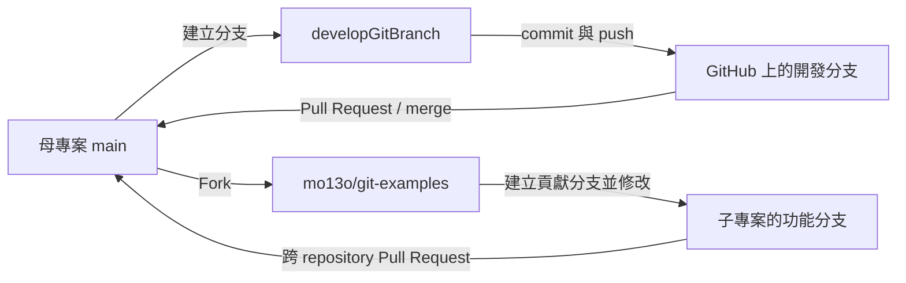

# Git / GitHub 協作流程實作紀錄

這份文件說明如何使用 Git 與 GitHub 完成以下四件事：

1. 建立分支（branch）
2. 合併分支（merge）
3. 建立分叉專案（fork）
4. 建立並合併 Pull Request（PR）

## 範例專案

- 母專案（upstream）：[`setestexamples/git-examples`](https://github.com/setestexamples/git-examples/commits/main/)
- 母專案的開發分支：[`developGitBranch`](https://github.com/setestexamples/git-examples/commits/developGitBranch)
- Fork 後的子專案：[`mo13o/git-examples`](https://github.com/mo13o/git-examples/commits/main/)

> 說明：以下內容是依照上述 repository 關係整理出的可重現操作流程。GitHub 上的 Fork 與 Pull Request 是平台操作；其餘工作可以用 Git 指令或 GitHub 網頁完成。

## 整體流程



## 事前準備

第一次使用 Git 時設定作者資訊：

```bash
git config --global user.name "你的 GitHub 名稱"
git config --global user.email "你的 GitHub Email"
```

將母專案複製到本機：

```bash
git clone https://github.com/setestexamples/git-examples.git
cd git-examples
```

確認目前分支與遠端 repository：

```bash
git branch --show-current
git remote -v
```

此時預期 `origin` 指向母專案：

```text
origin  https://github.com/setestexamples/git-examples.git (fetch)
origin  https://github.com/setestexamples/git-examples.git (push)
```

## 1. 建立分支

先更新本機的 `main`，再從最新的 `main` 建立並切換到 `developGitBranch`：

```bash
git switch main
git pull origin main
git switch -c developGitBranch
```

其中：

- `git switch main`：切換到主分支。
- `git pull origin main`：取得遠端 `main` 的最新內容並合併到本機。
- `git switch -c developGitBranch`：建立新分支並立即切換過去。

修改檔案後，將變更加入暫存區並建立 commit：

```bash
git status
git add .
git commit -m "Add example for Git branch workflow"
```

第一次將此分支推送到 GitHub：

```bash
git push -u origin developGitBranch
```

`-u` 會建立本機分支與遠端分支的追蹤關係；之後可以直接使用 `git push`。

也可以完全使用 GitHub 網頁建立分支：在 repository 首頁點選分支選單（預設顯示 `main`），輸入 `developGitBranch`，再選擇 **Create branch: developGitBranch from main**。

## 2. 合併分支

### 建議方式：透過 Pull Request 合併

將 `developGitBranch` push 到 GitHub 後：

1. 開啟母專案的 **Pull requests** 頁籤。
2. 點選 **New pull request**。
3. 設定 `base: main`、`compare: developGitBranch`。
4. 檢查差異，點選 **Create pull request**。
5. 填寫標題與說明，送出 PR。
6. 完成檢查或審查後，點選 **Merge pull request**，再按 **Confirm merge**。
7. 若分支已不再使用，可按 **Delete branch**。

合併完成後，在本機同步最新結果：

```bash
git switch main
git pull origin main
git branch -d developGitBranch
```

若遠端分支尚未透過 GitHub 刪除，可執行：

```bash
git push origin --delete developGitBranch
```

### 純 Git 指令方式

如果不需要程式碼審查，也可在本機直接合併：

```bash
git switch main
git pull origin main
git merge --no-ff developGitBranch
git push origin main
```

`--no-ff` 會保留一個明確的 merge commit，較容易從歷史看出分支何時被合併。不過在多人協作時，透過 PR 審查後再合併通常更合適。

## 3. Fork 母專案

Fork 是在自己的 GitHub 帳號下建立一份母專案的副本，適合沒有母專案寫入權限、但仍想提出修改的情境。

GitHub 網頁操作如下：

1. 開啟母專案 [`setestexamples/git-examples`](https://github.com/setestexamples/git-examples)。
2. 點選右上角 **Fork**。
3. Owner 選擇自己的帳號（本例為 `mo13o`）。
4. Repository name 保留 `git-examples`。
5. 點選 **Create fork**。

完成後會得到子專案 [`mo13o/git-examples`](https://github.com/mo13o/git-examples/commits/main/)。

接著複製自己的 fork，並把原始母專案登錄為 `upstream`：

```bash
git clone https://github.com/mo13o/git-examples.git
cd git-examples
git remote add upstream https://github.com/setestexamples/git-examples.git
git remote -v
```

此時遠端的用途為：

- `origin`：自己的 fork，可以 push。
- `upstream`：原始母專案，用來取得最新變更。

開始修改前，先同步母專案：

```bash
git fetch upstream
git switch main
git merge --ff-only upstream/main
git push origin main
```

再建立一個短期功能分支，不建議直接在 fork 的 `main` 上工作：

```bash
git switch -c docs/update-readme
# 編輯檔案
git add .
git commit -m "docs: update README"
git push -u origin docs/update-readme
```

## 4. 從 fork 建立 Pull Request

當修改已推送到自己的 fork 後：

1. 開啟子專案 `mo13o/git-examples`。
2. 點選 **Contribute** → **Open pull request**；也可以到母專案的 **Pull requests** → **New pull request** → **compare across forks**。
3. 確認合併方向：
   - base repository：`setestexamples/git-examples`
   - base branch：`main`
   - head repository：`mo13o/git-examples`
   - compare branch：`docs/update-readme`（或實際使用的分支）
4. 檢查 **Files changed**，填寫修改目的與測試結果。
5. 點選 **Create pull request**。
6. 若審查者要求修改，在原分支繼續 commit、push，PR 會自動更新。
7. 通過審查與自動檢查後，由母專案維護者合併 PR。

若已安裝 GitHub CLI，也可以建立 PR：

```bash
gh pr create \
  --repo setestexamples/git-examples \
  --base main \
  --head mo13o:docs/update-readme \
  --title "docs: update README" \
  --body "說明本次修改內容與原因"
```

## 這是哪一種 Git 工作流程？

這個例子最接近 **GitHub Flow（搭配 Forking Workflow）**：

- `main` 是主要且可隨時整合的長期分支。
- 每項工作從 `main` 建立獨立的短期分支。
- 修改以 commit 保存並 push 到 GitHub。
- 使用 Pull Request 討論、審查與合併。
- 外部貢獻者先 fork，再從自己的分支向母專案提出 PR。

它**不是完整的 Git Flow**。雖然範例分支叫做 `developGitBranch`，名稱中有 `develop`，但 Git Flow 通常會長期維護 `main/master` 與 `develop` 兩條分支，並另外使用 `feature`、`release`、`hotfix` 等短期分支。本例若只是從 `main` 建立一條工作分支、完成後以 PR 合併回 `main` 並刪除，仍屬較簡單的 GitHub Flow。

Fork 也不是另一套分支模型；它是 GitHub 上的 repository 協作方式，常與 GitHub Flow 一起使用，尤其適合開源專案或沒有直接寫入權限的貢獻者。

## Branch、Fork、Pull Request 與 Merge 的差別

| 名稱 | 所在位置 | 主要目的 |
| --- | --- | --- |
| Branch | 同一個 Git repository | 隔離一項功能或修正，避免直接影響 `main` |
| Fork | 另一個 GitHub 帳號下的 repository | 在沒有母專案寫入權限時建立可自由修改的副本 |
| Pull Request | GitHub 的協作機制 | 提議把一個 branch 或 fork 的變更合併到目標分支，並進行討論與審查 |
| Merge | Git 的歷史整合動作 | 將兩條開發歷史合併；可以在本機執行，也可以由 GitHub 合併 PR |

## 常用檢查指令

```bash
# 檢查工作目錄狀態
git status

# 列出本機及遠端分支
git branch -a

# 查看遠端 repository
git remote -v

# 以圖形方式查看分支與合併歷史
git log --oneline --graph --decorate --all

# 比較開發分支相對於 main 的變更
git diff main...developGitBranch
```

## 建議

- 一個分支只處理一個明確目的，PR 會比較容易審查。
- 提交訊息應描述「做了什麼」，避免只寫 `update` 或 `fix`。
- 合併前先同步 `main`，並確認測試與自動檢查通過。
- 重要的 `main` 分支可設為 protected branch，要求 PR、審查與狀態檢查，避免直接 push。
- PR 合併後刪除已完成的短期分支，保持分支清單整潔。

## 參考資料

1. [Git 工作流程——阮一峰](https://www.ruanyifeng.com/blog/2015/12/git-workflow.html)
2. [How Git Works — ByteByteGo](https://bytebytego.com/guides/how-does-git-work/)
3. [GitHub Docs：Pull request quickstart](https://docs.github.com/en/pull-requests/get-started/quickstart-for-pull-requests)
4. [GitHub Docs：About pull requests](https://docs.github.com/en/pull-requests/collaborating-with-pull-requests/proposing-changes-to-your-work-with-pull-requests/about-pull-requests)
