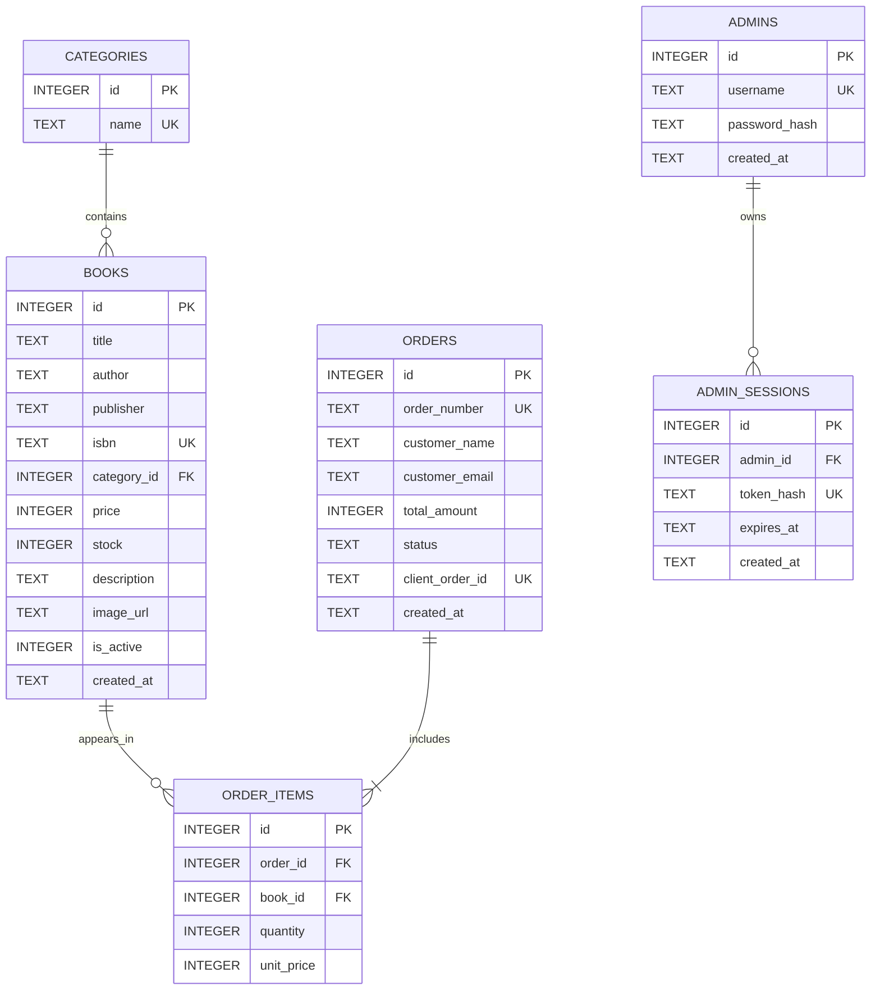

# BookNest ER Diagram

```mermaid
erDiagram
  CATEGORIES ||--o{ BOOKS : contains
  BOOKS ||--o{ ORDER_ITEMS : appears_in
  ORDERS ||--|{ ORDER_ITEMS : includes
  ADMINS ||--o{ ADMIN_SESSIONS : owns

  CATEGORIES {
    INTEGER id PK
    TEXT name UK
  }
  BOOKS {
    INTEGER id PK
    TEXT title
    TEXT author
    TEXT publisher
    TEXT isbn UK
    INTEGER category_id FK
    INTEGER price
    INTEGER stock
    TEXT description
    TEXT image_url
    INTEGER is_active
    TEXT created_at
  }
  ORDERS {
    INTEGER id PK
    TEXT order_number UK
    TEXT customer_name
    TEXT customer_email
    INTEGER total_amount
    TEXT status
    TEXT client_order_id UK
    TEXT created_at
  }
  ORDER_ITEMS {
    INTEGER id PK
    INTEGER order_id FK
    INTEGER book_id FK
    INTEGER quantity
    INTEGER unit_price
  }
  ADMINS {
    INTEGER id PK
    TEXT username UK
    TEXT password_hash
    TEXT created_at
  }
  ADMIN_SESSIONS {
    INTEGER id PK
    INTEGER admin_id FK
    TEXT token_hash UK
    TEXT expires_at
    TEXT created_at
  }
```

金額以新台幣整數保存；`order_items.unit_price` 保存下單當時價格。書籍下架使用 `is_active = 0`，避免破壞歷史訂單。

